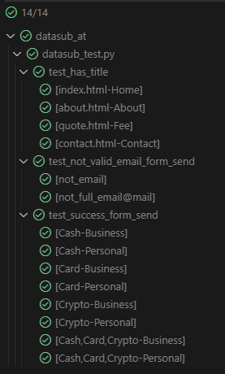

#  test_has_title 
проверка заголовков страниц, параметры: 
1) url адрес страницы
2) title заголовок страницы

#  test_success_form_send
проверка успешной отправки формы, параметры:
1) purpose выбор из вариантов Business, Personal
2) withdraws выбор из вариантов Cash, Card , Crypto

# test_not_valid_email_form_send
проверка ошибки отправки формы, не коректный имейл
параметр email принимает имейл для ввода

# Пример прогона тестов pytest
